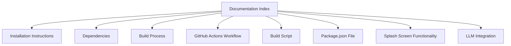

# Documentation Index

Welcome to the documentation for the macOS editor. Below is a summary of the available documentation:

- [Installation Instructions](installation.md)
- [Dependencies](dependencies.md)
- [Build Process](build-process.md)
- [GitHub Actions Workflow](github-actions.md)
- [Build Script](build-script.md)
- [Package.json File](package-json.md)
- [Splash Screen Functionality](splash-screen.md)
- [LLM Integration](llm/llm-integration.en.md)

## Documentation Structure

